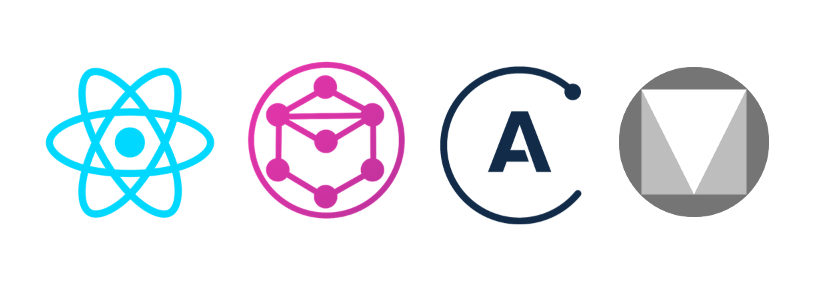

# ReGrAM - React + GraphQL + Apollo + Material (Boilerplate)

  

This project is a boilerplate for creating [React](https://reactjs.org/)/[GraphQL](http://graphql.org/)/[Apollo](https://www.apollographql.com/)/[Material](https://material.io/) applications.  

We're using some core concepts of all of those technologies and creating some new concepts as well, aiming to have a fast, painless and pleasant development experience, even with complex software requirements.  

This is a working progress project, but we're already using some of the concepts here in production and we're confident that this structure, concepts, conventions and technologies are worth it to invest on.  

## First Steps
There's a blog post about ReGrAM you should read first. It has all instructions and concepts behind the project: [https://nasc.io/posts/introducing-regram-graphql-apollo-material-boilerplate/](https://nasc.io/posts/introducing-regram-graphql-apollo-material-boilerplate/)

The easiest way to start is by cloning this repository, however, you can "merge" this boilerplate with your existent application, or start a new one using `create-react-app` or something similar.  

```
git clone git@github.com:NascHQ/react-graphql-apollo-material-boilerplate.git
cd react-graphql-apollo-material-boilerplate
yarn install
yarn start
```

That's it. You're good to go!  

