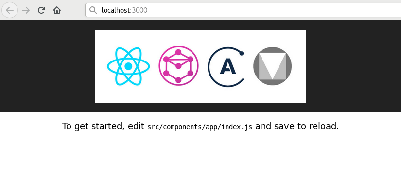
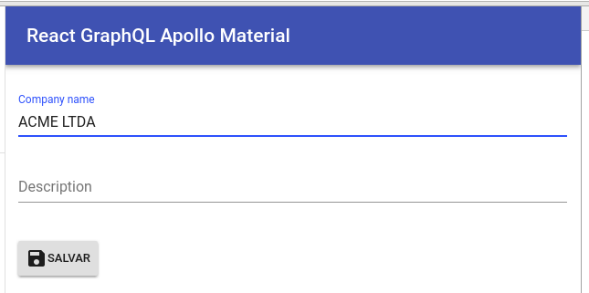
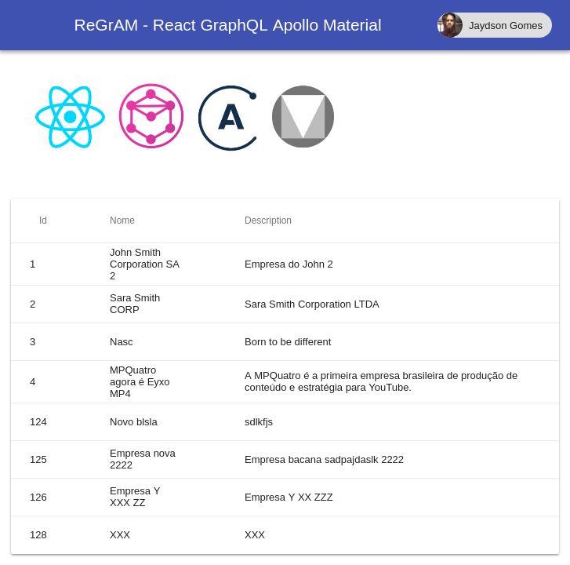

  

This project is a boilerplate for creating applications based on [React](https://reactjs.org/)/[GraphQL](http://graphql.org/)/[Apollo](https://www.apollographql.com/)/[Material](https://material.io/).  

We're using some core concepts of all of those technologies and creating some new concepts as well, aiming to have a fast, painless and pleasant development experience, even with complex software requirements.  

This is a working progress project, but we're already using some of the concepts here in production and we're confident that this structure, concepts, conventions and technologies are worth it to invest on.  

## Table of Contents

- [Technologies](#technologies)
- [Concepts](#concepts)
    - [Folder structure](#folder-structure)
    - [Components (React + GraphQL)](#components-react--graphql)
    - [Components (React + Material)](#components-react--material)
- [First steps](#first-steps)
- [Creating components](#creating-components)
    - [Create customer component](#create-customer-component)
    - [Edit customer component](#edit-customer-component)
    - [List customer component](#list-customer-component)

## Technologies

**GraphQL** is *de facto* the new standard for creating great APIs.  
It's easy to consume, easy to implement, easy to integrate and a lot more of nicer things.  
We recently stumble on the awesome [PostGraphQL](https://github.com/postgraphql/postgraphql) project, which generates a GraphQL API by reflection over a PostgreSQL schema.  
We always loved PostgreSQL and we were implementing GraphQL for a new application, so **PostGraphQL** fitted like a glove for us 😀  
With PostGraphQL we can focus on the database schema modeling, entities, relationships, etc., and then PostGraphQL do its magic and we have a great GraphQL API for our applications.  

There's a lot of front-end libraries out there, and we are still experimenting all of those, even that just for fun, but **React** seems to be (at least now) a good choice for the kind of projects we're building at Nasc.  
GraphQL and React were built by Facebook, but it's not that easy to integrate them, that's where **Apollo** appears.  
Apollo provides a universal GraphQL API on top of your existing services.  
Basically, Apollo binds data to the UI (React in our case), but it does a little more usefull things, like caching responses.  
I'll tell you the API is not that beautiful, but with workaround here and there, you're good to go.  

Talking about interface, we need a cool and fancy style guide for our components.  
[Google Material(https://material.io/) give us that and more.  
We're using the great [MaterialUI](https://material-ui-next.com/), which are React components that implement Google's Material Design.  

That's it.  
Of course we're using other technologies and projects as well, like [Create React App](https://github.com/facebookincubator/create-react-app), but the mentioned above are the main ones.  

## Concepts
The concepts behind this boilerplate are very attached to the technologies involved itself.  
We encourage you do adopt the folder structure and conventions to achieve a satisfactory development experience.  

### Folder structure
We're extending Create React App structure.  

```
react-graphql-apollo-material-boilerplate
├── package.json
├── public
│   ├── favicon.ico
│   ├── index.html
│   └── manifest.json
├── README.md
├── src
│   ├── components
│   │   └── app
│   │       ├── index.css
│   │       └── index.js
│   ├── index.css
│   ├── index.js
│   ├── lib
│   │   ├── apollo.js
│   │   └── util.js
│   ├── logo.svg
│   └── registerServiceWorker.js
└── yarn.lock
```

All components should be placed inside the `src/components` directory.  
We're using the sub-components strategy, where we nest all related components.  
For example, if we have a `customer` entity in our application and we'll have different components related to this entity, everything should stay inside a top level `customer` dir.  
```
src/components/customer/
├── edit
│   └── index.js
├── list
│   └── index.js
├── new
│   └── index.js
├── index.css
├── index.js
└── graphql.js
```

You can put all JavaScript helper code inside the `src/lib` dir.  
All Apollo related stuff should be in the `apollo.js` file.  
For now, we're just creating the Apollo client:  

```javascript
export const client = new ApolloClient({
  link: new HttpLink({ uri: 'http://localhost:5000/graphql' }),
  cache: new InMemoryCache()
})
```
Note that here is the place you must change your GraphQL endpoint.  
We probably could evolve this to a top level configuration file soon.  

### Components (React + GraphQL)
There isn't much to talk about React components (if you're not familiar, go to the docs: [https://reactjs.org](https://reactjs.org/)).  
The key here is the integration between React + GraphQL.  

Each component which will communicate somehow with the GraphQL API should have a `graphql.js` file inside the top level dir.  
This file defines all necessary component queries and mutations.  
Let's use the same `customer` entity example.  
Imagine we want to have a component listing all customers and another component providing the feature to add a customer.  
Our folder structure should be something like this:  

```
src/components/customer/
├── list
│   └── index.js
├── new
│   └── index.js
└── graphql.js
```

Our `graphql.js` content will define our queries and mutations:  

```javascript
import gql from 'graphql-tag'

export const ADD_ORGANIZATION = gql`
    mutation createOrganization(
      $name: String!, 
      $description: String!) {
      createOrganization(input: {
        organization: { 
          ownerId:1, 
          name: $name, 
          description: $description
        }
      }) {
          organization {
            id
          }
      }
    }
`
export const LIST_ORGANIZATION = gql`{
  allOrganizations(condition: {active: true}) {
    edges {
      node {
        id
        name
        description
      }
    }
  }
}`

```
The `graphql.js` should export constants (capitalized) with all operations you'll need for the entity components. 
Then, you can just import the pieces you want inside the component.  

### Components (React + Material)
As mentioned before, we're basing our components on the Material design.  
[MaterialUI](https://material-ui-next.com/) is helping us with the React integration.  
With MaterialUI the integration is pretty straightforward (mostly of the times).  

The strategy here is encapsulate your application components using the available Material components. It's basically a composition of your own components with the existent ones provided by the MaterialUI.  
So, if you need a button in your component:  

```javascript
import Button from 'material-ui/Button'

class MyComponent extends Component {
  render() {
    return (
      <Button 
        className='button' raised dense 
        onClick={}>
        <Save className='leftIcon' />
        Save
      </Button>
    )
  }
}

export default MyComponent
```
You can check all Material components on the demos section of website: [https://material-ui-next.com/](https://material-ui-next.com/demos/)  

## First Steps
The easiest to start is by cloning this repository, however, you can "merge" this boilerplate with your existent application, or start a new one using `create-react-app` or something similar.  

```
git clone git@github.com:NascHQ/react-graphql-apollo-material-boilerplate.git
cd react-graphql-apollo-material-boilerplate
yarn install
yarn start
```

That's it. You're good to go!  



## Creating components
Let's see in practice how to create components using this boilerplate and all of the technologies involved.  
We'll implement customer components, allowing the *create*, *list* and *edit* operations.  

### Create customer component
First, create a directory called `customer` inside the `components` folder.  
Following the sub-components convention, add a new directory called `new`, to represent our component, which will provide the functionality to add new customers in our application.  

Now we'll mix all together, React + Apollo + GraphQL + Material.  
Let's implement the logic for our `CustomerNew` component, creating the entry point `index.js`.  

```javascript
import React, { Component } from 'react'
import TextField from 'material-ui/TextField'
import Save from 'material-ui-icons/Save'
import Button from 'material-ui/Button'
import { client } from '../../../lib/apollo'
import { ApolloProvider, graphql } from 'react-apollo'
import { ADD_ORGANIZATION } from '../graphql'

class CustomerNew extends Component {

  handleChange = name => event => {
    this.setState({
      [name]: event.target.value
    })
  }

  createCustomer () {
    const { name, description } = this.state
    await this.props.createCustomerMutation({
      variables: {
        name,
        description
      }
    })
  }
  
  render() {
    return (
      <ApolloProvider client={client}>
        <div className='main'>
          <TextField
            id="name"
            label="Company name"
            className='textField'
            margin="normal"
            autoFocus={true}
            onChange={this.handleChange('name')}
            />
          <TextField
            id="multiline-flexible"
            label="Description"
            multiline
            rowsMax="4"
            className='textField'
            margin="normal"
            onChange={this.handleChange('description')}
            />
          <Button 
            className='button' raised dense 
            onClick={() => this.createCustomer()}>
            <Save className='leftIcon' />
            Save
          </Button>
        </div>
      </ApolloProvider>
    )
  }
}

export default graphql(ADD_ORGANIZATION, {
  name: 'createCustomerMutation'
})(CustomerEdit)
```

What we are doing here?  

1. Importing all Material stuff we'll need  
2. Importing the Apollo client, provider and the `graphql` method  
3. Importing the `ADD_ORGANIZATION` GraphQL mutation

Things to know:  

1. The last line exports the component calling the `graphql` method, which will handle all things for us  
2. Apollo will bind the mutation to our component `props`  
3. Then we can just call the mutation passing the necessary data

Now we need to create the GraphQL mutation.  
Create a file called `graphql.js` on the top level of customer dir.  

```javascript
import gql from 'graphql-tag'

export const ADD_ORGANIZATION = gql`
  mutation(
    $name: String!, 
    $description: String!) {
    createOrganization(input: {
      organization: { 
        name: $name, 
        description: $description
      }
    }) {
      organization {
        id
      }
    }
  }
`
```
Note that this mutation is based on the GraphQL API we have. You probably will have something different, but the cool thing is you can just copy the mutation and paste here.  
That's pretty much all we need to do.  

Here's our rendered component ready to add some customers!  



### Edit customer component
OK, now our application can create customers, but we need to have the ability to edit as well.  
Let's do it.  

Following the convention, add a new directory called `edit`, to represent our component, which will provide the functionality to edit a give customer in our application.  
Let's implement the logic for our `CustomerEdit` component, creating the entry point `index.js`.  

```javascript
import React, { Component } from 'react'
import TextField from 'material-ui/TextField'
import Save from 'material-ui-icons/Save'
import Button from 'material-ui/Button'
import { graphql } from 'react-apollo'
import { ApolloProvider } from 'react-apollo'
import { client } from '../../../lib/apollo'
import { UPDATE_ORGANIZATION } from '../graphql'

class CustomerEdit extends Component {

  handleChange = name => event => {
    this.setState({
      [name]: event.target.value
    })
  }

  updateCustomer = async (id) => {
    const { name, description } = this.state
    await this.props.updateCustomerMutation({
      variables: {
        id,
        name,
        description
      }
    })
  }
  
  render() {
    const org = this.props.location.state.organization
    // TODO: If there's no state we should get the organization data from GraphQL
    // This is the scenario where a user is trying to access the URL directly
    return (
      <ApolloProvider client={client}>
        <div className='main'>
          <TextField
            id="name"
            label="Company name"
            className='textField'
            defaultValue={org.name}
            margin="normal"
            autoFocus={true}
            onChange={this.handleChange('name')}
            />
          <br />
          <TextField
            id="multiline-flexible"
            label="Description"
            defaultValue={org.description}
            multiline
            rowsMax="4"
            className='textField'
            margin="normal"
            onChange={this.handleChange('description')}
          />
          <Button 
            className='button' raised dense 
            onClick={() => this.updateCustomer(org.id)}>
            <Save className='leftIcon' />
            Save
          </Button>
        </div>
      </ApolloProvider>
    )
  }
}

export default graphql(UPDATE_ORGANIZATION, {
  name: 'updateCustomerMutation'
})(CustomerEdit)
```

It's almost the same process, but note something on this line:  

```javascript
const org = this.props.location.state.organization
```

We need to bind the customer data somehow to the `CustomerEdit` component.  
There's some ways to acomplish that. We're passing this data throught the state (still need some investigation for the best approach).  
We'll show you how in the next section (we're bindind the customer data in the list component context).  

What about the mutation?  
Edit the `graphql.js` file and add the `UPDATE_ORGANIZATION` mutation.  

```javascript
export const UPDATE_ORGANIZATION = gql`
  mutation (
    $id: Int!,
    $name: String,
    $description: String) {
    updateOrganizationById(input: {
      id: $id
      organizationPatch: {
        name: $name,
        description: $description
      }
    }) {
      organization {
        id
      }
    }
  }
`
```

### List customer component
Now that we have customers, let's list them!  

Following the convention, add a new directory called `list`, to represent our component, which will provide the functionality to list all customers in our application.  
Let's implement the logic for our `CustomerList` component, creating the entry point `index.js`.  

```javascript
import React, { Component } from 'react'
import { Link } from 'react-router-dom'
import { graphql } from 'react-apollo'
import { ApolloProvider } from 'react-apollo'
import { client } from '../../../lib/apollo'
import Table, { TableBody, TableCell, TableHead, TableRow } from 'material-ui/Table'
import IconButton from 'material-ui/IconButton'
import EditIcon from 'material-ui-icons/Edit'
import Paper from 'material-ui/Paper'
import Button from 'material-ui/Button'
import AddIcon from 'material-ui-icons/Add'
import { LIST_ORGANIZATION } from '../graphql'

class CustomerList extends Component {
    
  render() {
    let orgs = this.props.data.allOrganizations
    return (
      <ApolloProvider client={client}>
        <div className='main'>
          <Paper>
            <Table className='table'>
              <TableHead>
                <TableRow>
                  <TableCell numeric>Id</TableCell>
                  <TableCell>Name</TableCell>
                  <TableCell>Description</TableCell>
                  <TableCell>Actions</TableCell>
                </TableRow>
              </TableHead>
              <TableBody>
                {orgs!== undefined && orgs.edges ? orgs.edges.map(({ node }) => (
                    <TableRow key={node.id}>
                      <TableCell key={node.id}>{node.id}</TableCell>
                      <TableCell>{node.name}</TableCell>
                      <TableCell>{node.description}</TableCell>
                      <TableCell>
                        <div className='list-actions'>
                          <Link to={{
                            pathname: `/customer/${node.id}`,
                            state: { organization: node }
                          }} >
                            <IconButton className='button' aria-label="Edit">
                              <EditIcon />
                            </IconButton>
                          </Link>
                        </div>
                      </TableCell>
                  </TableRow>
                )) : <TableRow><TableCell>Nope</TableCell></TableRow>}
              </TableBody>
            </Table>
          </Paper>
          <br />
          <Link to="/customer/new">
            <Button fab color="primary" aria-label="add" className='button'>
              <AddIcon />
            </Button>
          </Link>
        </div>
      </ApolloProvider>
    )
  }
}

export default graphql(LIST_ORGANIZATION)(CustomerList)
```

Same old same old, but here we have something really cool, the first line in the `render` method:  
```javascript
let orgs = this.props.data.allOrganizations
```
Apollo binds the data to the `props` of our component, so we just need to loop through the customer list.  
But which data is binded?  
Well, now it's time to create our query.  
Edit the `graphql.js` file and add the `LIST_ORGANIZATION` query.  

```javascript
export const LIST_ORGANIZATION = gql`{
  allOrganizations(condition: {active: true}) {
    edges {
      node {
        id
        name
        description
      }
    }
  }
}`
```

One of the cool things about GraphQL is the power is in the of the consumer.  
So as you can see, the `LIST_ORGANIZATION` query is returning the fields I wanted.  
In your application you should have different needs, but with this boilerplate you can just change the query and the component structure to have things working.  

Here's our rendered component listing our customers!  


